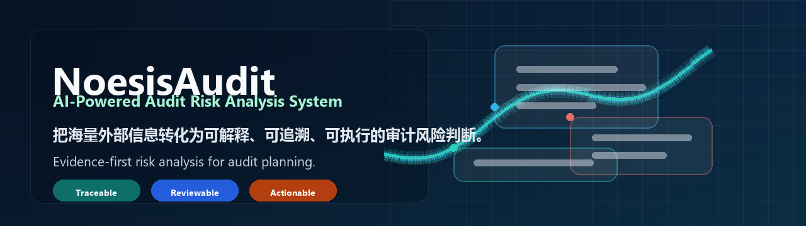
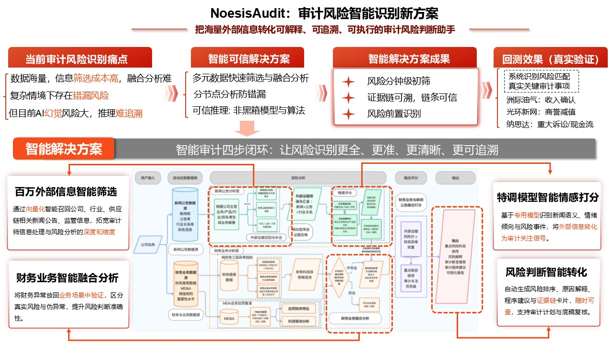
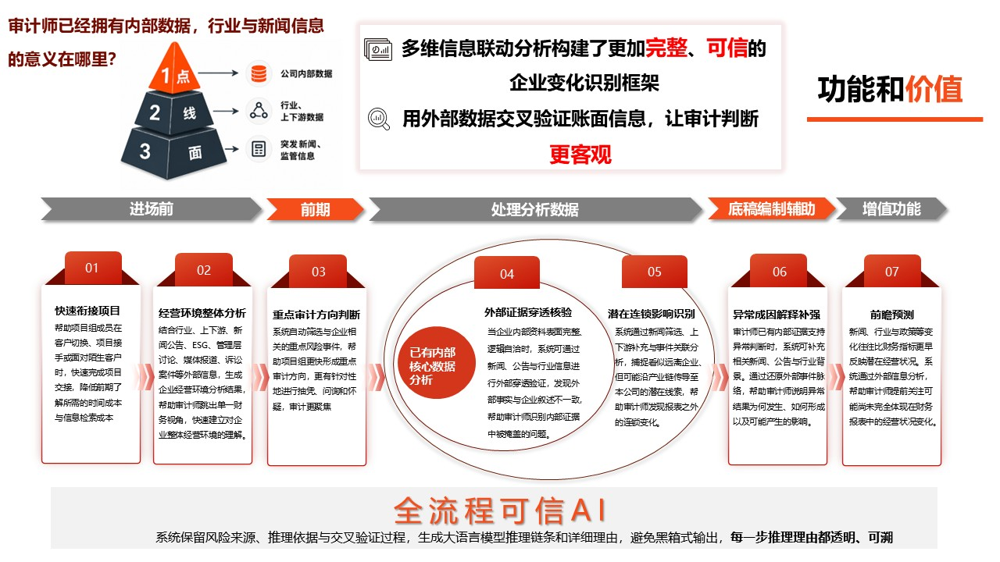
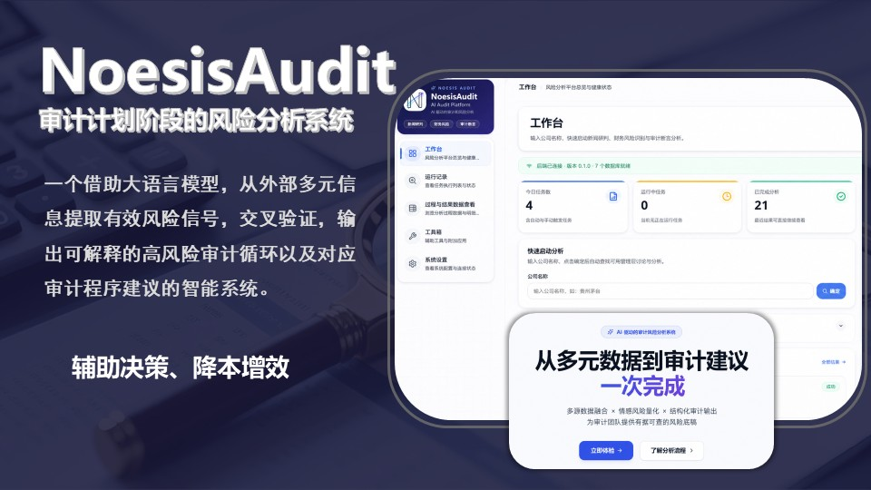
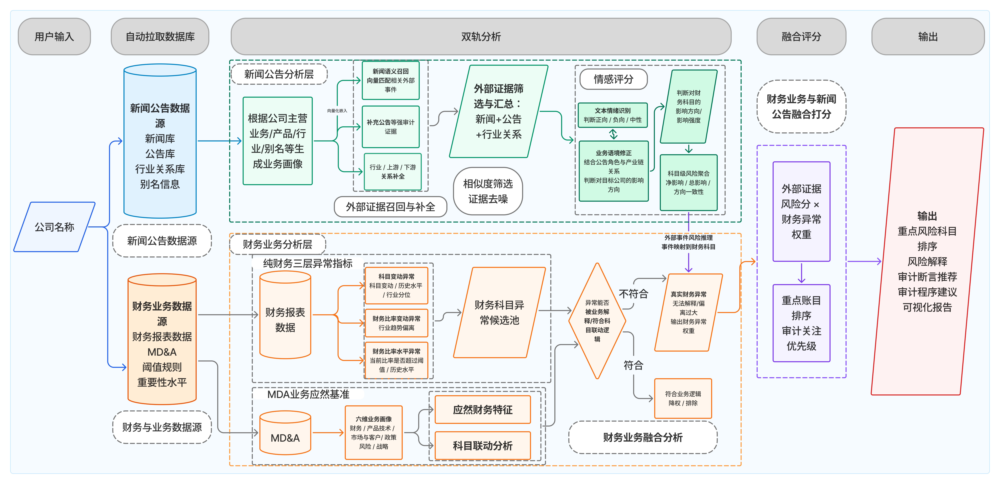
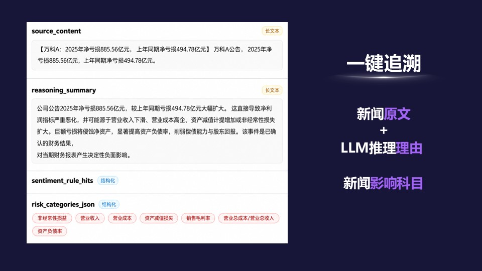



# NoesisAudit

### AI-Powered Audit Risk Analysis System | AI 驱动的审计风险分析系统

**把海量外部信息转化为可解释、可追溯、可执行的审计风险判断。**  
**Convert massive external signals into explainable, traceable, and actionable audit risk judgment.**

[Watch Demo / 产品演示](NoesisAudit-product-demo.mp4) · [System Overview / 系统概览](docs/NoesisAudit-system-overview.pdf) · [Business Plan / 商业计划书](docs/NoesisAudit-business-plan.pdf) · [Demo Guide / 演示说明](docs/NoesisAudit-product-demo-guide.md)

---

## Product Demo | 产品演示

<video src="NoesisAudit-product-demo.mp4" controls width="100%" title="NoesisAudit product demo"></video>

If the video does not render inline, open [NoesisAudit-product-demo.mp4](NoesisAudit-product-demo.mp4) directly.  
如果当前 Markdown 预览器不支持内嵌播放，请直接打开 [NoesisAudit-product-demo.mp4](NoesisAudit-product-demo.mp4)。

---

## Product Overview | 产品总览

NoesisAudit gives audit teams a structured way to turn external signals, financial indicators, annual reports, MD&A, and regulatory information into reviewable audit risk judgment.

NoesisAudit 为审计团队提供一套结构化方法，将外部信息、财务指标、年报、MD&A 与监管信息转化为可复核的审计风险判断。

It is built for the audit planning stage: identify key risks earlier, trace evidence more clearly, and translate risk signals into assertion mapping and procedure recommendations.

它服务于审计计划阶段：更早识别重点风险，更清晰追溯证据，并将风险信号转化为审计断言匹配和程序建议。

---

## Why External Evidence Matters | 外部证据为什么重要

Auditors already have internal data. The missing layer is often external context: news, announcements, industry changes, litigation, supply-chain events, policy shifts, and public disclosures that explain or challenge the financial narrative.

审计人员已经掌握内部资料，但真正容易缺失的是外部语境：新闻、公告、行业变化、诉讼、供应链事件、政策变化和公开披露。这些信息可以解释财务异常，也可以反向验证企业叙述。

> **审计行业缺的不是 AI，而是可信的 AI。**  
> **Audit teams do not just need AI. They need trustworthy AI.**

---

## Product Positioning | 产品定位

NoesisAudit is not a general chatbot. It is a risk-analysis workflow designed for audit planning: multi-source screening, risk identification, evidence tracing, assertion mapping, and audit procedure recommendation.

NoesisAudit 不是通用问答工具，而是面向审计计划阶段的风险分析工作流：多源筛选、风险识别、证据追溯、断言匹配和审计程序建议。

---

## How It Works | 工作流

NoesisAudit connects five audit-planning steps into one workflow:

1. **Multi-source information screening | 多源外部信息筛选**  
   News, announcements, industry relationships, regulatory signals, annual reports, financial data, and MD&A are collected and filtered.

2. **Risk event identification | 风险事件识别**  
   Dedicated analysis models identify risk events, sentiment direction, account impact, and event strength.

3. **Financial-business fusion | 财务业务融合分析**  
   Financial anomalies are placed back into business context to distinguish real risks from false positives.

4. **Evidence chain tracing | 证据链追溯**  
   Sources, reasoning summaries, account links, and cross-validation evidence remain reviewable.

5. **Audit procedure recommendation | 审计程序建议**  
   The system converts risk signals into account focus, assertion mapping, audit direction, and procedure suggestions.

---

## Evidence-First AI | 证据优先的 AI

> **风险提示不是终点，证据链才是可信判断的起点。**  
> **A risk alert is not the endpoint. The evidence chain is where credible judgment begins.**

NoesisAudit keeps risk sources, reasoning paths, and cross-validation evidence traceable. Auditors can review why a risk was identified, which evidence supports it, and how it links to audit assertions and procedures.

NoesisAudit 保留风险来源、推理路径和交叉验证证据。审计人员可以复核风险为什么被识别、证据来自哪里、如何关联到审计断言和程序建议。

## Validation | 验证

The product materials include back-testing examples where system-identified risks are compared with real key audit matters or emphasis-of-matter items, including cases such as revenue recognition, goodwill impairment, litigation, and cash-flow pressure.

项目材料中包含真实案例回测：将系统识别出的风险与真实关键审计事项或强调事项进行对照，覆盖收入确认、商誉减值、重大诉讼、现金流压力等审计关注方向。

---

## Core Capabilities | 核心能力

- **Multi-source external information screening | 多源外部信息筛选**
- **Risk event identification and sentiment scoring | 风险事件识别与情感评分**
- **Financial anomaly and business context analysis | 财务异常与业务语境分析**
- **Evidence chain tracing | 证据链追溯**
- **Risk ranking and explanation | 风险排序与原因解释**
- **Audit assertion mapping | 审计断言匹配**
- **Audit procedure recommendation | 审计程序建议**
- **Risk dashboard and visual explanation | 风险看板与可视化解释**

---

## Product Materials | 项目材料

| Material 材料 | File 文件 | Notes 说明 |
| --- | --- | --- |
| Product demo 产品演示 | [NoesisAudit-product-demo.mp4](NoesisAudit-product-demo.mp4) | Full video walkthrough 完整视频演示 |
| System overview 系统概览 | [docs/NoesisAudit-system-overview.pdf](docs/NoesisAudit-system-overview.pdf) | Concise product overview and value narrative 产品总览与价值说明 |
| Business plan 商业计划书 | [docs/NoesisAudit-business-plan.pdf](docs/NoesisAudit-business-plan.pdf) | Product, market and feasibility 产品、市场与可行性 |
| Presentation deck 路演材料 | [NoesisAudit-presentation-deck.pptx](NoesisAudit-presentation-deck.pptx) | Full product presentation 完整产品路演材料 |
| Demo guide 演示说明 | [docs/NoesisAudit-product-demo-guide.md](docs/NoesisAudit-product-demo-guide.md) | Demo viewing notes 演示观看说明 |

---

## Disclaimer | 免责声明

NoesisAudit is designed to support professional judgment. It does not replace auditors, certified public accountants, formal audit procedures, or independent professional review.

NoesisAudit 用于辅助专业判断，不替代审计人员、注册会计师、正式审计程序或独立专业复核。

**From black-box output to traceable evidence. From experience-only judgment to data-supported audit planning.**  
**从结果黑箱走向证据可溯，从经验驱动走向数据驱动。**

## Contact | 联系方式

For inquiries, feedback, or collaboration opportunities, please contact:  
Email: [2965675629@qq.com]

如有任何问题、反馈或合作意向，请联系：  
邮箱：[2965675629@qq.com]

